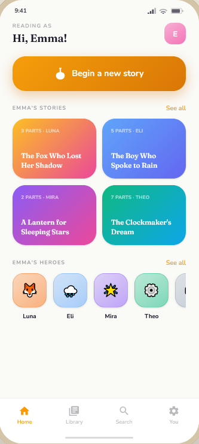
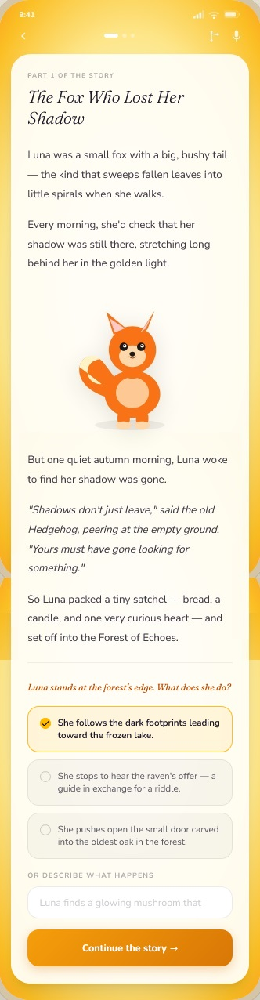
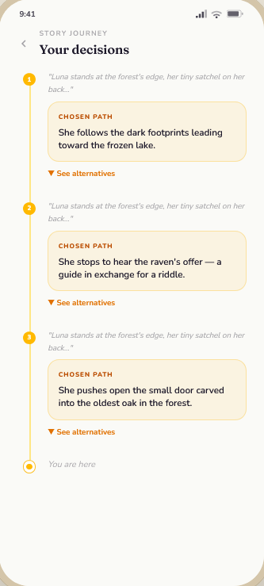
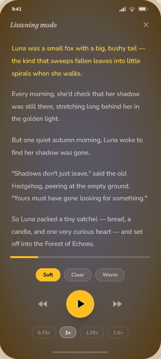

# Bardery

Yet another AI storytelling app, but this time you decide how the story continues.

## Vision

Each part of the story ends in a decision. Pick one of the suggested paths or describe your own, and Bardery writes and illustrates what happens next. You can go back to any earlier decision and branch off a new version of the story, or have the story read aloud.

<table>
  <tr>
    <td align="center" valign="top"> Your stories and heroes</td>
    <td align="center" valign="top"> Decide how the story continues</td>
    <td align="center" valign="top"> Revisit decisions and branch off</td>
    <td align="center" valign="top"> Listen with narration</td>
  </tr>
</table>

These are early UI prototypes. See [`docs/design/`](docs/design/) for all screens.

## Goal

Bardery is a public reference for building a production-ready, AI-powered full-stack application: an Expo app for iOS, Android and web, a TypeScript backend, and AI generation of text, illustrations and narration, all running in the EU on Azure. Beyond the features, it shows the engineering around them: a clean layered architecture, tests, evaluations for the AI workflows, observability, infrastructure as code and CI/CD.

## Documentation

- [`CONTEXT.md`](CONTEXT.md): the domain glossary.
- [`docs/adr/`](docs/adr/): architecture decision records.
- [`docs/grilling/`](docs/grilling/): the design sessions behind the product and technical decisions.
- [`docs/design/`](docs/design/): the UI prototype.

## Licence

[AGPL-3.0](https://www.gnu.org/licenses/agpl-3.0.html).
