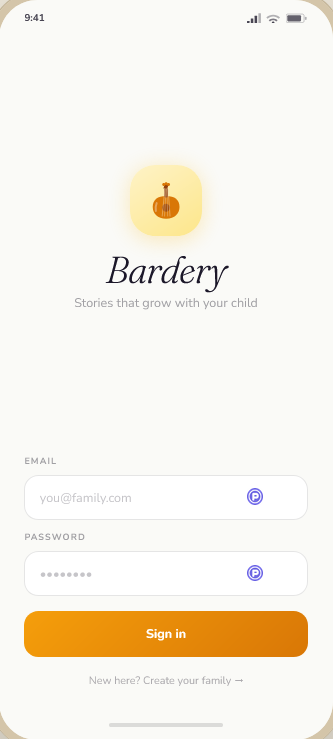
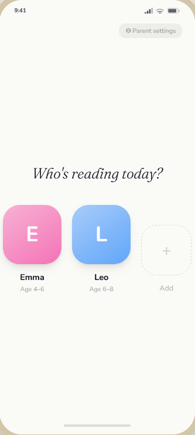
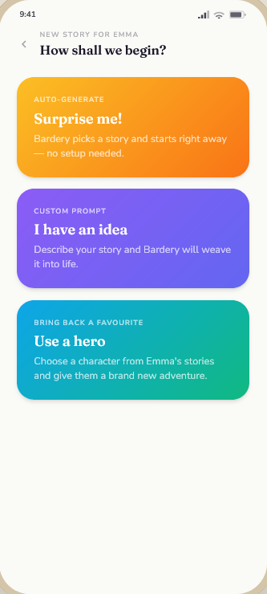
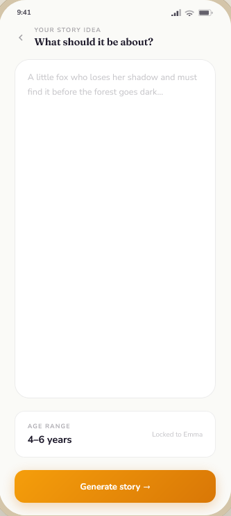
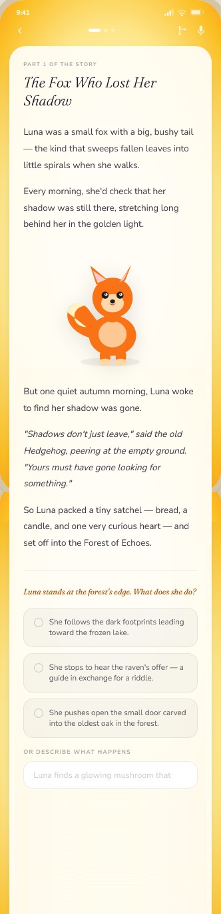
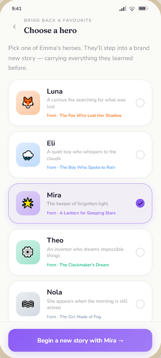
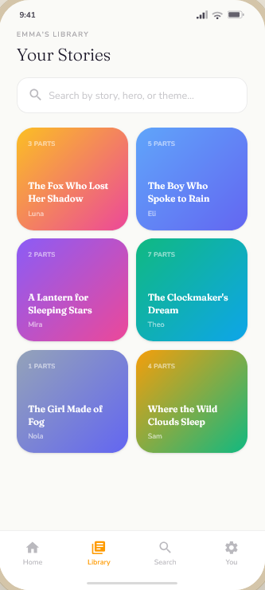

# Screens

# 01-login

# 02-profile-selection

The user can select a profile or create a new one.
An account can have multiple profiles. Stories and heros are bound to profiles. Profiles have an age. Stories are created according to this age range.

# 03-home

The home screen. The user can either start creating a new story or continue reading or listening to the last story or browse his stories or browse his heros.

# 04-create-story

The user can either let the app come up with the beginning of a story from a blank page or the user can create a story from a text prompt or from an existing hero.

# 05-create-from-prompt

The user can write a prompt in a free text field as a starting point for the app to generate a story from.

# 06-story

The story. Text and images are rendered vertically. There is background gradient that changes as the story progresses. The text color is dark. The paragraphs have a bright background that fades out towards the border to let the colourful background gradient shine.

# 07-story-decision-selected

The user has selected one of the suggested decision. The button underneath the decision saying "Continue the story" is now active.

# 08-decisions

This screen shows the decisions the user made for this version of the story and what alternatives were proposed. He can select an alternative and branch new version off of this branch.

# 09-heros

A screen showing the heros from the profile's stories. Every story has one or more heros. When clicking on a hero, the user can read the hero's existing stories or create a new story with him.

# 10-stories-with-search

The user can browse all the profile's stories or do a semantic search powered by a vector database.

# 11-audio-mode

The user can let the app with different voices read the story.

